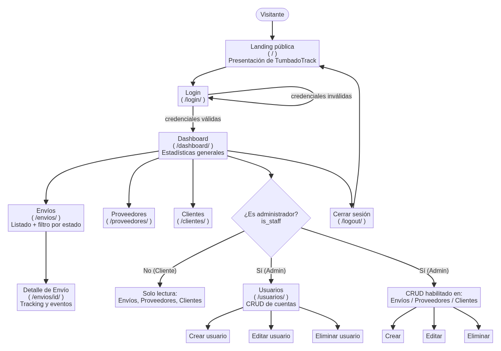

# Evaluación 1 — Entregables (Fase 1: Análisis, Diagramación y Prototipado)

Caso seleccionado: **Music Pro Company · Transporte y Logística — Courier (Proveedor ↔ Cliente)**
(línea de desarrollo "Sistema de Transporte y Despachos" del caso semestral, aplicada al Tour 2026 de Natanael Cano).

## 1. Diagrama de flujo

Representa la navegación completa del sitio y las bifurcaciones según el rol del usuario
(visitante anónimo, cliente autenticado, administrador).

**Lectura del diagrama:**

- Un visitante entra a la **landing pública** (`/`), que presenta el sistema, y accede al **login** (`/login/`).
- Con credenciales válidas llega al **Dashboard** (`/dashboard/`), punto central desde el que navega a
  Envíos, Proveedores, Clientes y (solo si es administrador) Usuarios.
- El acceso a **crear/editar/eliminar** en Envíos, Proveedores, Clientes y Usuarios está condicionado a
  `is_staff` (administrador); un usuario cliente solo tiene lectura.
- **Cerrar sesión** vuelve siempre a la landing pública.

## 2. Mockups / Prototipo de interfaz

Capturas del prototipo funcional ya implementado en Django + Tailwind, que sirven como mockup de cada
vista principal del flujo:

| Vista | Descripción | Captura |
|---|---|---|
| Landing pública | Presentación del sistema antes del login | [mockups/landing.png](mockups/landing.png) |
| Login | Autenticación de usuarios | [mockups/login.png](mockups/login.png) |
| Dashboard | Estadísticas generales del sistema | [mockups/dashboard.png](mockups/dashboard.png) |
| Listado de Envíos | Filtro por estado, acceso a tracking | [mockups/lista_envios.png](mockups/lista_envios.png) |
| Detalle de Envío | Tracking e historial de eventos | [mockups/detalle_envio.png](mockups/detalle_envio.png) |
| Listado de Proveedores | Datos de contacto y puntualidad | [mockups/lista_proveedores.png](mockups/lista_proveedores.png) |
| Listado de Clientes | Recintos/venues del tour | [mockups/lista_clientes.png](mockups/lista_clientes.png) |
| Listado de Usuarios (admin) | CRUD de cuentas, solo administradores | [mockups/lista_usuarios.png](mockups/lista_usuarios.png) |
| Formulario Crear Envío (admin) | Alta de un nuevo envío | [mockups/form_crear_envio.png](mockups/form_crear_envio.png) |

## 3. Relación con la rúbrica de Evaluación 1

| Indicador | Evidencia |
|---|---|
| 1.1.1 Identifica variables y operaciones del lenguaje | Modelo de datos del caso en `courier/data/seed_data.py` (Unidad 1, sin BD) |
| 1.1.2 Codifica instrucciones, estructuras y operadores | `courier/views.py`: condicionales y filtros que replican el diagrama de flujo |
| 1.1.3 Codifica instrucciones utilizando paquetes externos | Tailwind CSS vía CDN en los templates; proyecto en GitHub |
| 1.1.4 Implementa una aplicación sencilla en Django | `config/` + `courier/` (startproject/startapp), `urls.py`, `views.py`, templates |

Repositorio: <https://github.com/Danieel17/TumbadoTrack>
