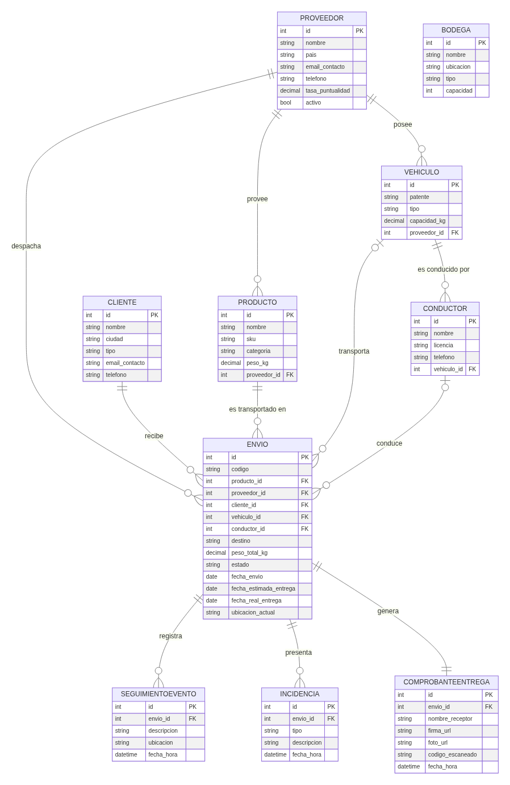

# Evaluación 2 — Aplicación web con Django Admin

## 1. Conexión a la base de datos

El proyecto usa SQLite, configurado en `config/settings.py`:

```python
DATABASES = {
    'default': {
        'ENGINE': 'django.db.backends.sqlite3',
        'NAME': BASE_DIR / 'db.sqlite3',
    }
}
```

Se verifica con `python manage.py check` y `python manage.py migrate` (sin errores).

## 2. Modelos y relaciones (10 tablas)

La app `courier` define 10 modelos relacionados entre sí (`courier/models.py`):

| Modelo | Relación |
|---|---|
| Proveedor | — |
| Cliente | — |
| Producto | FK → Proveedor |
| Bodega | — (independiente) |
| Vehículo | FK → Proveedor |
| Conductor | FK → Vehículo |
| Envío | FK → Producto, Proveedor, Cliente, Vehículo, Conductor |
| SeguimientoEvento | FK → Envío |
| Incidencia | FK → Envío |
| ComprobanteEntrega | OneToOne → Envío |

## 3. Diagrama de base de datos



(Fuente editable: [diagrama-entidad-relacion.mmd](diagrama-entidad-relacion.mmd), sintaxis Mermaid `erDiagram`.)

## 4. Migraciones

Historial en `courier/migrations/`:

- `0001_initial.py` — modelos originales (Proveedor, Cliente, Producto, Bodega, Envío, SeguimientoEvento).
- `0002_alter_bodega_ubicacion_alter_cliente_email_contacto_and_more.py` — `verbose_name` en español.
- `0003_conductor_comprobanteentrega_envio_conductor_and_more.py` — agrega Vehículo, Conductor, Incidencia, ComprobanteEntrega y los campos `vehiculo`/`conductor` en Envío.
- `0004_alter_conductor_options_alter_vehiculo_options.py` — nombres en plural correctos ("Vehículos", "Conductores").

## 5. Datos ficticios con Faker

Comando `courier/management/commands/generar_datos_faker.py`:

```bash
python manage.py seed_datos          # datos curados del caso (Tour Natanael Cano)
python manage.py generar_datos_faker --cantidad 15   # datos ficticios con Faker
```

Genera proveedores, clientes, vehículos, conductores y envíos (con sus eventos, incidencias y
comprobantes de entrega) usando la librería `Faker`, verificados en base de datos:

```
Proveedor: 10   Cliente: 12   Vehiculo: 6   Conductor: 6
Envio: 21   SeguimientoEvento: 32   Incidencia: 9   ComprobanteEntrega: 5
```

## 6. Django Admin

Los 10 modelos están registrados en `courier/admin.py`, con `list_display`, `list_filter` y
`search_fields` configurados para cada uno, más inlines de `SeguimientoEvento` e `Incidencia`
dentro de `Envío`.

Evidencia del ciclo completo (crear → consultar → modificar → eliminar) en
[mockups_admin/](mockups_admin/):

| Paso | Captura |
|---|---|
| Panel principal con los 10 modelos registrados | [01_admin_index.png](mockups_admin/01_admin_index.png) |
| Listado de Vehículos (con filtros y búsqueda) | [02_admin_vehiculo_listado.png](mockups_admin/02_admin_vehiculo_listado.png) |
| Crear un vehículo | [03_admin_vehiculo_crear.png](mockups_admin/03_admin_vehiculo_crear.png) |
| Vehículo creado | [04_admin_vehiculo_creado.png](mockups_admin/04_admin_vehiculo_creado.png) |
| Editar el vehículo | [05_admin_vehiculo_editar.png](mockups_admin/05_admin_vehiculo_editar.png) |
| Confirmar eliminación | [06_admin_vehiculo_confirmar_eliminar.png](mockups_admin/06_admin_vehiculo_confirmar_eliminar.png) |
| Vehículo eliminado (mensaje de éxito) | [07_admin_vehiculo_eliminado.png](mockups_admin/07_admin_vehiculo_eliminado.png) |

## 7. Relación con la rúbrica de Evaluación 2

| Indicador | Evidencia |
|---|---|
| 1. Conexión a BD configurada y verificada | `config/settings.py`, `manage.py check` |
| 2. Modelos con atributos, tipos, claves y relaciones | `courier/models.py` (10 modelos) |
| 3. Migraciones + diagrama de BD + datos ficticios con Faker | Sección 4, 3 y 5 de este documento |
| 4. Acceso a Django Admin y modelos registrados | `courier/admin.py` |
| 5. Visualización configurada (list_display, filtros, búsqueda) | `courier/admin.py` |
| 6. Crear registros vía Django Admin | Captura 03/04 |
| 7. Consultar registros vía Django Admin | Captura 02 |
| 8. Modificar registros vía Django Admin | Captura 05 |
| 9. Eliminar registros vía Django Admin | Captura 06/07 |
| 10. Explicar el funcionamiento de Django Admin | Ver `Explicacion_Proyecto_TumbadoTrack.docx` |

Repositorio: <https://github.com/Danieel17/TumbadoTrack>
